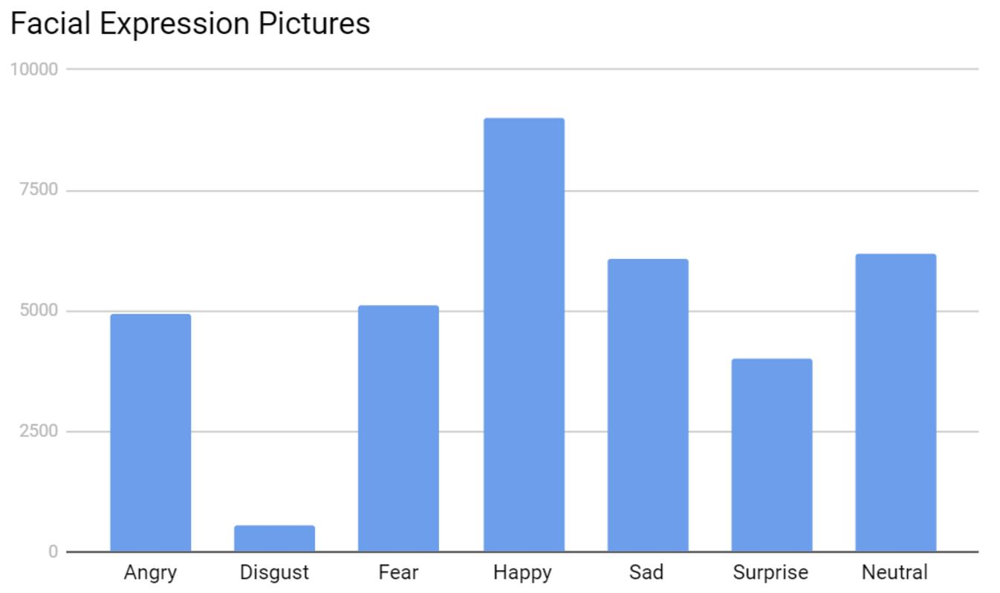
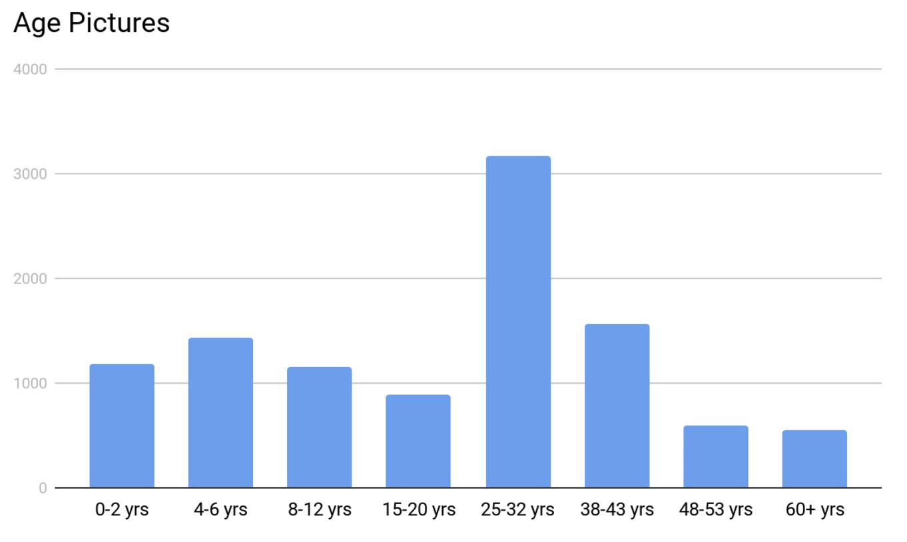
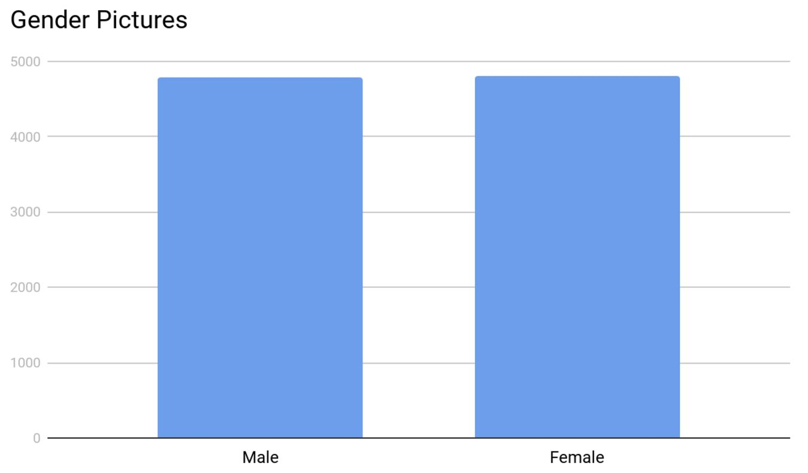
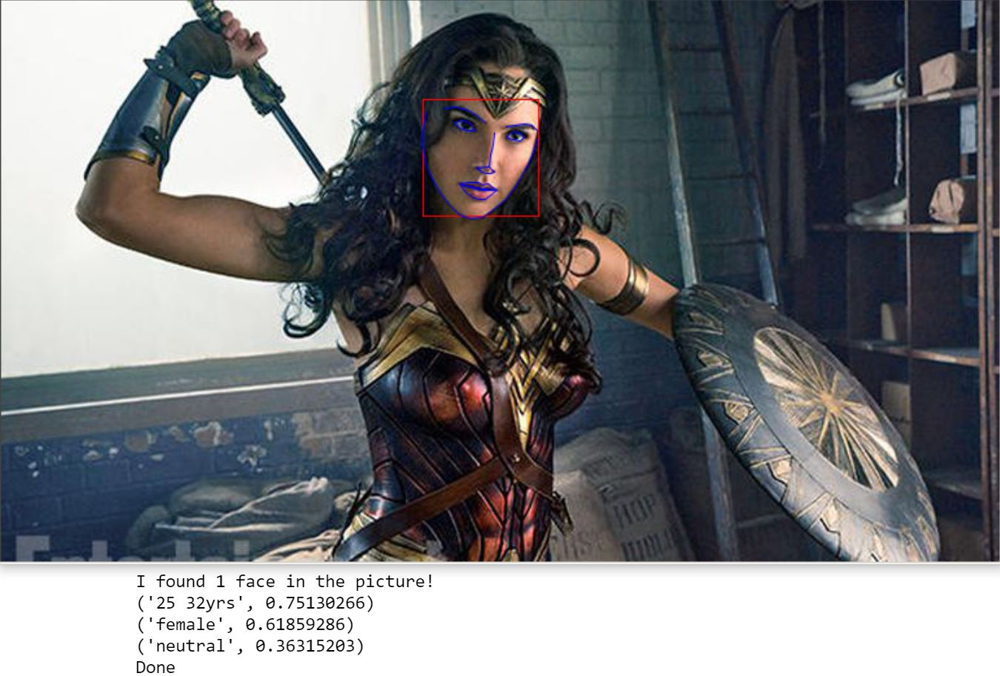

##  Motivation

Communication is an integral part of our lives. How we communicate with others is largely based on their age, mood, gender, and our relationship with them. By teaching a machine how to identify these traits, we can build better virtual assistants. I also thought it would be fun to do a deep dive into image recognition and deep learning because they seem like super fun topics.

## Data

Open University of Israel - Face Image Project, also known as [adience](http://www.openu.ac.il/home/hassner/Adience/data.html), and the [Facial Expression Recognition Challenge](https://www.kaggle.com/c/challenges-in-representation-learning-facial-expression-recognition-challenge) hosted at Kaggle were used as data sources. Adience files were used for Age and Gender. The Facial Expression dataset was used for mood.

It was particularly difficult finding data that was categorized and bundled. One alternative would have been to do an image search and download the results. This, however, would pose many challenges, especially for the Age component of my model. There is no way to verify if the images that return as a result of our search are accurate. Another reason would be that rarely do we only get images of what we are searching for. It would take tremendous hours of work to go through all the pictures and delete irrelevant ones.

The adience files are color pictures of all sizes that were gathered from user uploads via Flickr with their permission. An example of a picture would be something like this:

 Picture 1: Some cool kid 

Face expression dataset is made of 48x48 grayscale images that were assembled using various websites. The data is a list of pixel values. These values can be converted into pictures such as the following;

​								Picture 2: He who must not be named

## EDA (Exploratory Data Analysis)

The facial expression dataset consists of 35,887 images broken into seven categories of emotion; Angry, Disgust, Fear, Happy, Sad, Surprise, and Neutral. After looking at how many pictures were in each category, I decided to to drop Disgust. Disgust only had 547 pictures, compared to all other categories which had over 4,000.

Looking through the pictures themselves, I noticed that some were of multiple faces, cartoons, or no faces. Although these pictures could be harmful to the model, they were kept in because they made up a very miniscule portion of the dataset. 

Adience data was a bit more difficult to deal with. Picture information was contained in multiple text files and did not point to the full filename of the pictures. After creating a CSV file, I removed duplicate images and those that did not belong to any of the age ranges contained in the data. When this step was completed, I had 14,150 images out of the 26,580 total. 

The next step was to look through the images to spot any misclassified images. This took me  about a full day to finish but it was very important to do as there were a large number of misclassifications. When the data cleaning was done, I had removed ~25% of the images. 

The distribution of the age groups looked a little funky with 25-32 yr group having most of the pictures. This was due to all the selfies we all love to take!

The distribution of gender was a lot better. Both groups had almost an equal number of pictures at ~4,800 each.

## Modeling

After much research, I chose to use a Convolutional Neural Network (CNN) due to their proven performance for image recognition and classification. The underlying CNN model I used for my project came from the [image retrain](https://github.com/tensorflow/tensorflow/blob/master/tensorflow/examples/image_retraining/retrain.py) script provided in the examples section of [Tensorflow](https://www.tensorflow.org/)'s GitHub repo.

This script uses [Inception V3](https://github.com/tensorflow/models/tree/master/inception) as its base and builds an output layer on top. Inception was trained using all of the images provided by [ImageNet](http://www.image-net.org/). Therefore, this method of training the CNN cuts down on time to get accurate results. Unfortunately, the image retrain script was written to run on Terminal (Command Prompt on Windows). However, I modified it to work with [Jupyter](https://jupyter.org/) notebooks. 

The next step was to train the neural networks. I ran the training three times; once for each category (Age, Gender, and Mood). Age and Gender models each took approximately 4 hours to complete. The Mood model took approximately 12 hours to complete. 

The last step was to write a script to classify these parameters by loading in any image and having it return the classification results. Before I got into passing pictures into my neural nets, I wanted to address the issue of potentially having multiple people in a picture. To get around this, I decided to crop each face and classify them individually then return the results. I was able to accomplish this by utilizing [Dlib](http://dlib.net/).

After all this was done, I passed in some images to see my predictions. My favorite ones to play around with were a screenshots from superhero movies because who doesn't love super heroes! Lets take this screenshot from Wonder Woman (2017) for example.

​					Gal Gadot had did an awesome job portraying Wonder Woman

After passing in this image into our model, it finds the face, labels it, and returns the categories this picture belongs to with their probabilities.

The picture is returned in a separate window and the prediction is displayed in Jupyter. Although this was fine for me, it was not very user friendly if anyone else was to run my code. Which brings us to the next part; building an app. 

## Flask Web App

Building the [Flask](flask.pocoo.org) app was where I had the most fun in this project. It was interesting to combine my Data Science skillset with those of what you might see in web development. 

## Conclusion/Next Steps

