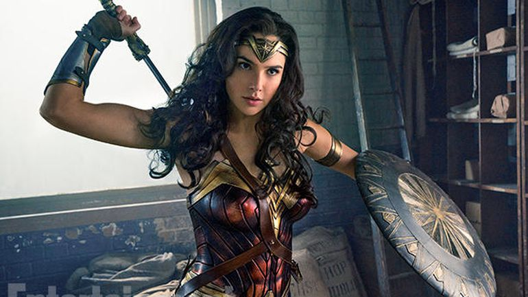

##  Motivation

Communication is an integral part of our lives. How we communicate with other is largely based on their age, mood, gender, and our relationship with them. By teaching a machine how to identify these traits, we can build better virtual assistants. I also thought it would be fun to do a deep dive into image recognition and deep learning because they seem like super fun topics!

## Data

Open University of Israel - Face Image Project, also known as [adience](http://www.openu.ac.il/home/hassner/Adience/data.html), and the [Facial Expression Recognition Challenge](https://www.kaggle.com/c/challenges-in-representation-learning-facial-expression-recognition-challenge) hosted at Kaggle were used as data sources. Adience files were used for Age and Gender. The Facial Expression dataset was used for mood.

It was particularly difficult finding data that was categorized and bundled. One alternative would have been to do an image search and download the results. This, however, would pose many challenges, especially for the Age component of my model. There is no way to verify if the images that return as a result of our search are accurate. Another reason would be that rarely do we only get images of what we are searching for. It would take tremendous hours of work to go through all the pictures and delete irrelevant ones.

The adience files are color pictures of all sizes that were gathered from user uploads via Flickr with their permission. An example of a picture would be something like this:

 Picture 1: Some cool kid 

Face expression dataset is made of 48x48 grayscale images that were assembled using various websites. The data is a list of pixel values. These values can be converted into pictures such as the following;

 
 

 Picture 2: He who must not be named 

## EDA (Exploratory Data Analysis)

The facial expression dataset consists of 35,887 images broken into seven categories of emotion; Angry, Disgust, Fear, Happy, Sad, Surprise, and Neutral. After looking at how many pictures were in each category, I decided to to drop Disgust. Disgust only had 547 pictures, compared to all other categories which had over 4,000.

 
 

Looking through the pictures themselves, I noticed that some were of multiple faces, cartoons, or no faces. Although these pictures could be harmful to the model, they were kept in because they made up a very miniscule portion of the dataset. 

Adience data was a bit more difficult to deal with. Picture information was contained in multiple text files and did not point to the full filenames of the pictures. After creating a CSV file, I removed duplicate images and those that did not belong to any of the age ranges contained in the data. When this step was completed, I had 14,150 images out of the 26,580 total. 

The next step was to look through the images to find any misclassifications. This took me  about a full day to finish but it was very important as there were a large number of misclassifications. When the data cleaning was done, I had removed ~25% of the images. 

The distribution of the age groups looked a little funky with 25-32 yr group having most of the pictures. This was due to all the selfies we all love to take!

 
 

The distribution of gender was a lot better. Both groups had almost an equal number of pictures at ~4,800 each.

 
 

## Modeling

After much research, I chose to use a Convolutional Neural Network (CNN) due to their proven performance for image recognition and classification. The underlying CNN model I used for my project came from the [image retrain](https://github.com/tensorflow/tensorflow/blob/master/tensorflow/examples/image_retraining/retrain.py) script provided in the examples section of [Tensorflow](https://www.tensorflow.org/)'s GitHub repo.

This script uses [Inception V3](https://github.com/tensorflow/models/tree/master/inception) which was was trained using all of the images provided by [ImageNet](http://www.image-net.org/) as its base and builds an output layer on top. This reduces the run time of training new models with accurate results. Unfortunately, the image retrain script was written to run on Terminal (Command Prompt on Windows). I did not like this as I wanted to work in a [Jupyter](https://jupyter.org/) notebook. After a couple of hours of modifying the code, I was able to get it working in a notebook setting.

The next step was to train the neural networks. I ran the training three times; once for each category (Age, Gender, and Mood). Age and Gender models each took approximately 4 hours to complete. The Mood model took approximately 12 hours to complete. 

The last step was to write a script to classify these parameters by loading in an image and having it return the classification results. Before I got into passing pictures into my neural nets, I wanted to address the issues of potentially having no faces or multiple faces in a picture. For multiple faces, I decided to crop each face and classify them individually. I was able to accomplish this by utilizing the face detection ability in [Dlib](http://dlib.net/). For no detected faces, I simply overlaid a ghost on a picture and returned the text "Oh no, there's a ghost in your picture!"

After all this was done, I passed in some images to see my predictions. My favorite ones to play around with were screenshots from superhero movies because who doesn't love super heroes! Lets take this screenshot from Wonder Woman (2017) for example.

 
  

 Gal Gadot did an awesome job portraying Wonder Woman 

After passing in this image into our model, it finds the face, labels it, and returns the categories this picture belongs to with their probabilities.

 
 

The picture is returned in a separate window and the prediction is displayed in Jupyter. Although this was fine for me, it was not very user friendly if anyone else was to run my code. Which brings us to the next part; building an app. 

## Flask Web App

Building the [Flask](flask.pocoo.org) app was where I had the most fun in this project. It was interesting to combine my Data Science skillset with those you might see in web development. Being able to create a front-end to work with python code was very exciting.

The biggest challenge I faced when creating the app was displaying the results to the user. More specifically the returning the modified picture. I did not want to save a picture before displaying it due to memory and discovery issues. As a result, I looked at ways of temporarily storing a picture in memory and being able to display it in HTML. After reading many StackOverflow answers and some creative coding, I was able to get this part done.

Another challenge was labeling the faces. Initially the faces were not labeled which posed a problem for someone trying to understand the predictions. There was no way to know which prediction belonged to which person. This prompted me to number each face in a picture. This was relatively easy to do. However, I was not happy with having the same font for each detected face. To avoid having static fonts, I looked at faces with varying face rectangles (the red rectangle around a detected face) and ran a linear regression model to have dynamic fonts. 

The last part was to make the whole thing look pretty. I did what anyone without web development experience would do and used [Bootstrap](http://getbootstrap.com/) to prettify my app. The website was very minimalistic with only a text entry form to enter the picture of a URL as shown below.

 

When the classification(s) are done, the user gets redirected to another page displaying my predictions. We can see an example below with Robert Downey Jr. as Iron Man where the model gets the age completely wrong.

 
 

## Conclusion/Next Steps

This was a great learning experience and I had a lot of fun working on this project. Finding labeled pictures was difficult due to the lack of publically available datasets in this area. As is with all modeling, the more data available, the more accurate our predictions. The end result was a model that can predict fairly well for each classification group with the data collected. However, there are many things that could be done better and/or more efficiently.

The prediction time per face is longer than I'd like it to be, ranging from 30 seconds to a minute. I know the time can be cut down significantly which is something I would like to work on. Another part is the web app. I would like to make it public by using [AWS](aws.amazon.com) or [Heroku](heroku.com). My initial efforts were fruitless due to some of the libraries being incompatible with these services. I have since then found some alternatives that I would like to test.

Lastly I would like to thank the entire DSI 5 cohort from General Assembly for their support throughout this project. I would also like to thank Nick Eng , Kyle Stanley, and John Snyder for their help and guidance. It has been a pleasure working with all of you!

Please feel free to leave and comments or questions below.